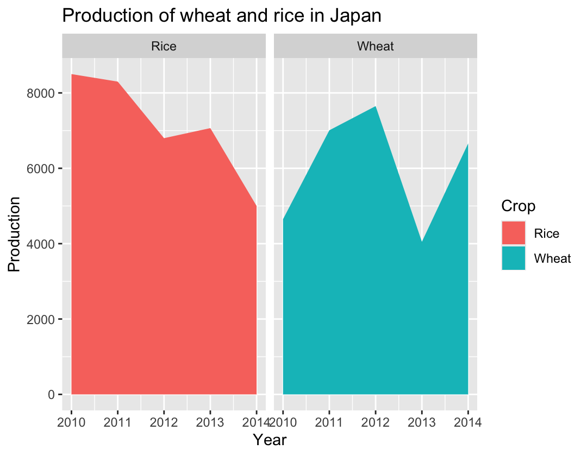
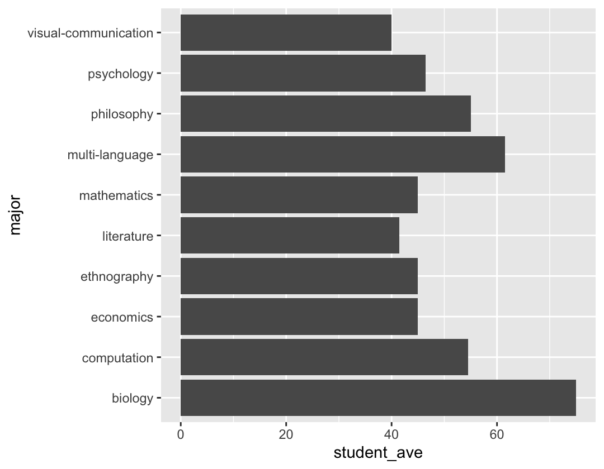
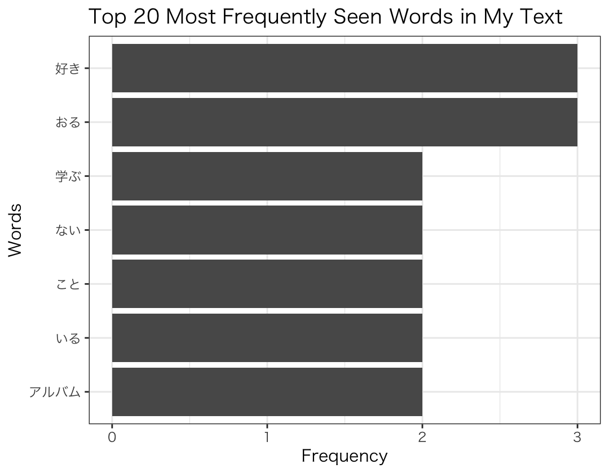

# Social Science Information Processing

Data analysis with R

## Description

- `data`: Data used for analysis.
- `scripts`: R Script samples.
  Put these in the root of your project directory

## Gallery

